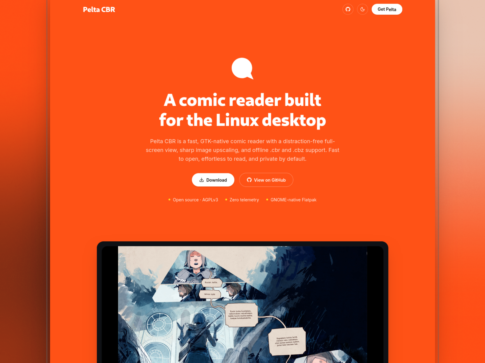

# Pelta CBR for Linux



Pelta is a comic reader for people who want to open a file and read. Its emphasis is on speed, a small surface area also staying out of the way. There is no library, no sync, and no account. Pelta does not keep a catalogue of your comics — on the contrary, each file opens on its own, and the only thing retained is how far you got, and only until you close the file.

This is the offline GNOME desktop version. Open a `.cbr`, `.cbz` or `.cbt` and start reading, with
no telemetry.

- Native GTK 4 + libadwaita app, Wayland only
- Reads archives with libarchive (the same approach as GNOME Papers), pages decoded on demand
- Single-page or two-page spreads, fullscreen reading
- Sharp scaling (linear-light Lanczos3 or Mitchell–Netravali) and optional auto contrast
- Ships as a Flatpak for x86_64 and ARM64

Website: [peltacbr.vercel.app](https://peltacbr.vercel.app)

## Why it exists

Someone handed me an old Surface they were not using. I put Fedora on it, then looked for something that would open `.cbr` / `.cbz` files well. There was not much that fitted, so I started building my own.

## Features

- Open comics via file dialog or drag-and-drop
- Formats: `.cbr` / `.rar`, `.cbz` / `.zip`, `.pdf`
- Smart upscaling so low-resolution scans read more clearly on modern screens
- Lanczos3 downscaling for oversized pages
- Automatic contrast and tint correction for yellowed paper and faded ink
- Page matte matched to each page's border colour
- Lazy page loading
- Pinch-zoom, swipe / hotspot page turns, fullscreen
- Natural sort for archive page order
- No library or collections — each file opens and reads on its own
- Fully offline, nothing to sync (zombie-apocalypse proof)

## Install

One line, on any distro with (or without) Flatpak:

```bash
curl -fsSL https://peltacbr.vercel.app/install.sh | bash
```

The installer checks Flatpak and Flathub, picks the build for your processor and installs it for
your user. You can also download the bundle for your processor from
[Releases](https://github.com/leonardobetti/pelta-cbr-linux/releases/latest) and open it with
GNOME Software or KDE Discover, or run:

```bash
flatpak install --user pelta-comic-reader-x86_64.flatpak
flatpak run com.pelta.ComicReader
```

## Build

The app follows the [gtk-rust-template](https://gitlab.gnome.org/World/Rust/gtk-rust-template)
layout: Meson drives Cargo and installs the desktop file, AppStream metadata and icons.

### Flatpak (recommended)

```bash
flatpak install flathub org.flatpak.Builder
flatpak run org.flatpak.Builder --user --install-deps-from=flathub --force-clean --install \
  build-dir packaging/com.pelta.ComicReader.yml
flatpak run com.pelta.ComicReader
```

### On the host

Needs Rust 1.92+, Meson, GTK ≥ 4.22, libadwaita ≥ 1.9 and libarchive development files.

```bash
cargo run
# or through Meson
meson setup _build -Dprofile=development && meson compile -C _build
```

## Layout

```
src/            Rust sources (window, archive reader, image processing, reading modes, settings)
data/           Desktop entry, AppStream metainfo, hicolor icons
packaging/      Flatpak manifest (org.gnome.Platform 50)
build-aux/      Meson Cargo helper, Wayland-only manifest check
```

## Releases

Publishing a GitHub release runs `.github/workflows/flatpak.yml`, which builds
`pelta-comic-reader-x86_64.flatpak` and `pelta-comic-reader-aarch64.flatpak` and attaches them to
the release. Keep the `-<arch>.flatpak` suffix: the website and `install.sh` look for it. The
bundles embed Flathub as their runtime source, so they install on machines that have never used
Flathub.

When the GNOME runtime moves on, bump `runtime-version` in the manifest and the CI image tag
together.

## Sandbox

The running app has no network access and no X11. It only asks for Wayland, IPC and GPU access,
and opens files through the file chooser portal. Network is used during the build, while Cargo
fetches crates.

## Contributors

Issues, ideas, and pull requests are welcome — especially around copy, packaging, and platform polish.

## Support

If you find Pelta useful, you can [buy me a coffee on Ko-fi](https://ko-fi.com/leonardobetti).

## License

[GNU AGPL v3 or later](LICENSE). Copyright © 2026 Leonardo Betti.

Pelta is also available for macOS, Windows and the browser from the
[website](https://peltacbr.vercel.app).
